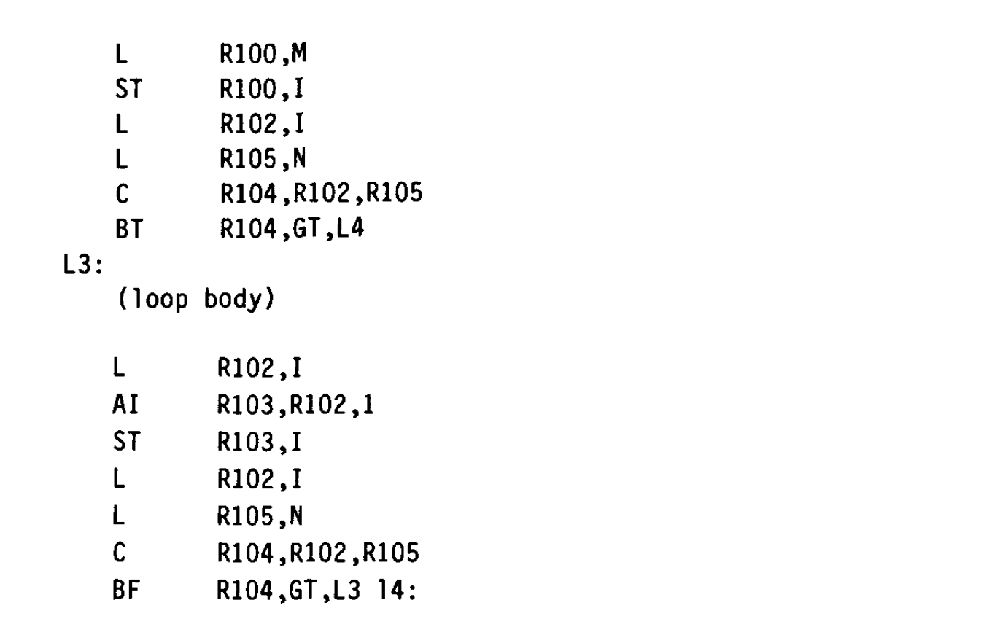
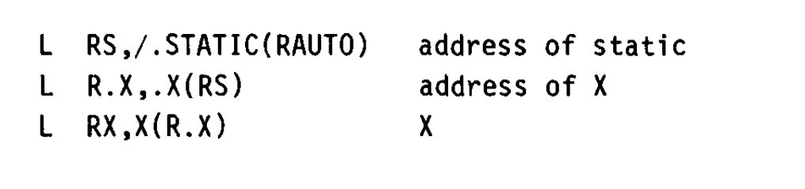
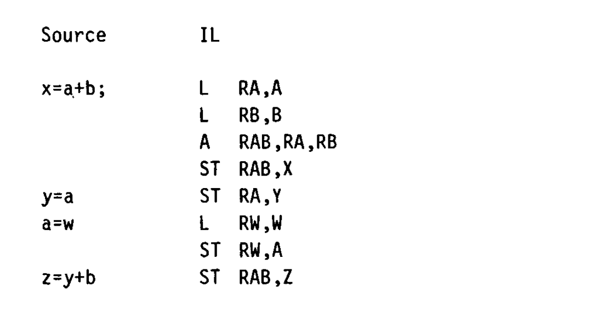
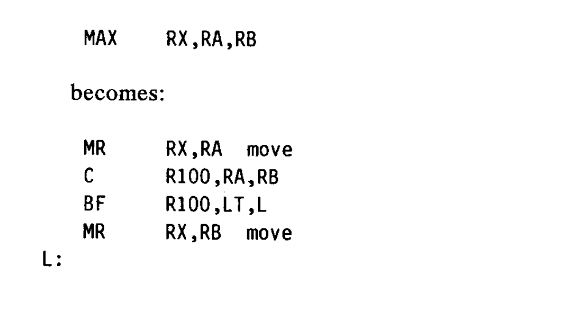
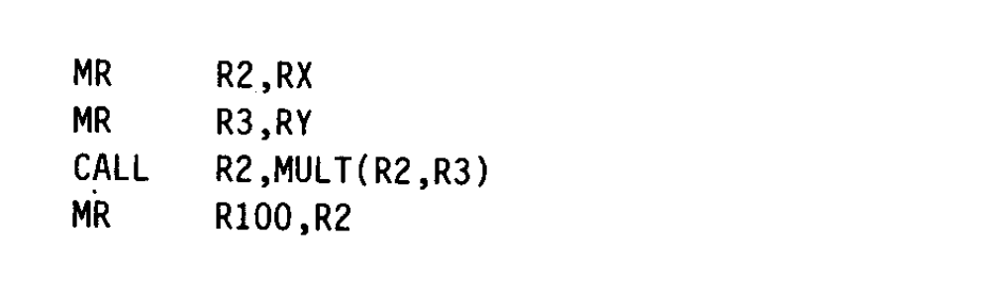
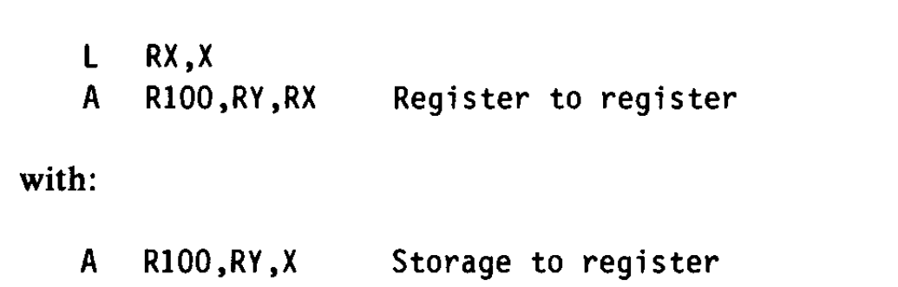
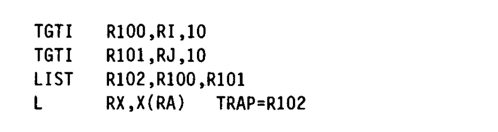

## 摘要

PL.8编译器接受多种源语言，并为几个不同机器生成高质量目标代码。使用的策略是先将源程序简单地转换成低级别中间语言。然后通过全局优化和寄存器分配来提高代码质量，而不是依赖于特殊代码选择。

 <!-- more -->

## 简介

PL.8是作为计算机架构，系统设计，编程语言和编译器技术之间交互的探索而开发的。目前它支持两种源语言，Pascal和PL.8，PL/I的一种进行系统编程的变种。为System/370，MC68000，801（10）和其它两种实验机器产生目标代码。编译器的作用是以不需要关注详细的性能问题的同时还能提供非常好的代码的方式支持高级语言编程。早期以这种方式使用优化编译器的经验是令人沮丧的。程序员因为性能原因不得不避免使用特定语言或方式。并且，需要覆盖更多好代码的场景的需求会导致编译器一直增长，直到它的体积，执行开销，或稳定性不够限制了进一步增长为止。为了避免这个复杂性，以及可以无成本地为语言和它的编译器添加许多新的特性，PL.8采用了将编译分解为一系列更简单和独立的问题的策略。

PL.8编译器有四个主要的组件。它们是：

转换 -- 源语言到中间语言（IL）的转换。中间语言可以被认为是一个简单抽象机器的指令集。

优化 -- 将中间语言转换为一个优化了运行时间或体积的等价程序。

寄存器分配 -- 把程序的寄存器空间归约到机器以及特定寄存器的分配。

末端汇编 -- 实际目标机器指令的选择，以及格式化编译器输出。

编译器进一步尽将优化划分为尽可能多的独立操作，使得它们更可靠和更容易实现。这种方法使得编译器能够可靠地生成目标代码，该代码通常优于以前的技术。（7）

在接下来的内容里，我们会描述PL.8编译器的整体结构，着重点是分离方案。我们也会描述使得这个方法可用所需的一些优化和寄存器分配技术，并且通过一个扩展例子，尝试提供一些这个技术为什么可以工作的一些见解。附录声明了使用的算法的一些更细节的报告。（3，4，5，6，8，9）

## 中间语言

IL可以被认为是一个简单抽象计算机的汇编语言。它的语义非常匹配目标机器的计算语义。它的整数运算是32位二进制补码，存储是32位地址空间里的字节地址。IL是以原始操作的线性字符串表示和处理的。这个代码可以被优化。为了最大的效果，它需要暴露所有可以在目标机器上执行的指令。因此，IL模式会比一些目标CPU更低级别。所有的计算都是在寄存器里完成的。即使没有存储到寄存器的加法或者类似的指令，代码也会被生成。因此源码语句：

```
x = y + z;
```

会产生如下结果：

```
L    RY, Y
L    RZ, Z
A    R100, RY, RZ
ST   R100, X
```

这样写的好处是任何或所有指令都可以通用化或者代码移动。例如，y的加载可以被移除到循环外，同时z的加载可以被循环里的另一个z的加载消除掉。（IL的一个简单描述参见附录。）

因为IL是低级别的，所以它比许多计算机更通用。例如，没有破坏指令。即使编译到System/370或者MC68000，这两个平台的Add的一个操作数会被破坏掉，Add也有两个操作数和一个结果操作数。另一方面，目标CPU会以微妙的方式显示出来。在MC68000范围是-32K到+32K，而在System/370是0到4K。这是非常需要暴露的，算术需要处理这些限制才能优化。因此，在MC68000上从位置5000加载一个变量只需要一条加载指令，而System/370需要：

```
AI  R100, R.X, 4096   Base of x + 4k
L   RX, X-4096(R100)  Load x
```

需要注意的是，IL体现了目标机器的某些特征，但不会影响到优化。我们在一个部分机器相关的IL上做机器无关的优化。

从某种意义上讲，IL像一个不存在的机器。它有无限多的符号寄存器。根据惯例，待有相同操作数的指令总是在相同符号寄存器里产生它们的结果。这有助于找到相同的子表达式。IL 的格式仅支持一个计算结果，即一个符号寄存器。此时忽略条件码。我们假设比较操作会产生一个符号寄存器，其包含小于、等于和大于位。IL分支测试这些符号寄存器位。IL也包含了一组字符串操作，它们会产生符号寄存器结果。这些操作与 IL 中的其他部分一样，都会进行相同的优化。

## 翻译

PL.8d的翻译是通过传统技术完成的。它是自底向上完成的，其中每个段的IL代码都是上下文无关输出的。翻译不针对特殊例子，而是关注源语言实现的整体计算策略。例如，PL.8转换器翻译如下循环语句do

```
do i = m to n;
...
end;
```

为IL等价代码:



因此，重复循环测试的策略是通过翻译实现的。得出m和n是什么（它们可能是常量或者表达式）或者i在循环是否被修改的所需分析，留给优化和寄存器分配在纳入考虑。例如，如果在循环头的代码被发现只包含常量操作数，优化会消除比较和跳转，给有常量边界的循环留下正确的特定场景。

上面的例子也表明了IL的控制操作是简单的条件和无条件跳转。程序的控制结构是从中间语言（IL）中推导出的，因为源代码程序的控制流结构已被消除了。这个方法简化了转换，并且使得优化独立于特定源语言的控制结构。

除了不做本应由优化阶段完成的分析外，翻译器也不进行寄存器分配。相反，该翻译器仅假设当前栈帧可通过某个寄存器寻址。其余所有地址计算均表示为从栈帧内起始点开始的完整寻址路径追踪。例如，获取一个被声明为外部静态变量x需要：



当程序被翻译后，PL.8不会给寄存器重新赋一个特定的值或地址。相反，如果为了获得最好的性能则需要将某个地址或者值赋给寄存器，这些操作将会由常规的优化和寄存器分配进行探索。

## 优化

这个编译器的优化部分执行一系列的独立转换。它们每个都可能被执行多次。重复执行优化的原因是每个优化都可能为其它优化提供新的优化机会，或者引入新的需要优化的代码。通过迭代处理这些交互作用，可以显著降低各个独立转换阶段的复杂性，正如优化过程能够降低翻译阶段的复杂性一样。这个方法需要IL的格式在所有优化期间保持不变性，因此任意转换的结果都可以作为另一个转换的输入。

PL.8中重要的转换有：

  死代码消除 - 消除那些计算结果没有被使用的计算。

  通用子表达式消除 - 消除那些计算结果与之前的仍然可用的计算结果相同或者等价的计算。

  代码移动 - 将计算移动到程序中的另一个位置，使得程序执行得更快。

  常量表达式计算 - 将操作数都是已知的操作在编译时计算出结果。

  强度削减 - 识别出出现在乘积中的迭代变量并且用其它变量替换这些乘积。（需要注意的是转换会将所有的地址，包括数据下标展开为隐式算术计算。因此，按 `do` 循环索引的数组引用将通过此优化进行处理。）

  值标号 - 一个执行通用子表达式消除更有效率的形式，它会将赋值的影响纳入考量。值标号可以在扩展基本块的范围里工作，它的通用子表达式消除是全局的。例如：



在变量改变之前，y+b的计算和a+b的计算是相同的。

  死存储消除 - 非常类似于死代码消除，只是它是应用在存储的值上而不是表达式的结果上。

  线性化 - 通过合并那些无条件关联到单个基本块的后继基本块，消除不必要的分支。

  陷阱消除 - 识别出一些越界值检查的场景，其可以通过适当地修改循环终止测试（9），而被从循环中移除。

  重关联 - 在循环内重排表达式，将所有循环常量值聚集在一起。例如，如果一个表达式具有以下形式：

  (loop varying+loop constant l)+loop constant2，

  其中没有一个计算可以被移出循环。通过重关联表达式为：

  (loop constantl +loop constant2)+loop varying,，

  可以将一个add移出循环。

所有上述优化转换（及其他技术）都将全面作用于中间语言（IL）程序，而此类程序的全部计算过程均显式暴露。用于计算地址值的算术被认为和计算程序值的算术是无差别的。被引入用于检查数组边界越界情况的条件表达式和那些用于实现源语言循环结构或者那些程序员实现的条件表达式是无差别的。因此，每个转换都在实践中经过了充分地测试，并且都被应用到每个被编译的程序。优化里可能会存在少数长期没有尝试过的地方，因为它所代表的特殊情况并不经常出现。

此外，转换的独立性使得它们之间都简化了同时还相互提高了。作为一个例子，代码移动事实上是一个复杂操作。需要寻找到循环里可以被循环外操作替换的操作。然后，这个计算需要被放在外面并且移除里面的。这个分析存在许多错误，可能会破坏程序。我们的方法是将移动替换成插入。一旦分析识别出需要移动的代码，实际上只是将代码复制到所要移动的位置。这个插入本身不会影响到程序。后面，通用子表达式消除会消除循环里的计算。因此，代码移动的正确性几乎可以由通用子表达式消除的正确性来保证。许多优化转换的实现方式可归结为：先进行简单代码修改，随后执行常规化的重优化。

## 操作展开

在一些实例中，最好的方式是去优化复杂操作然后展开。在展开之后，需要在做优化来处理新暴露出来的操作。在大部分的架构里都是通过比较和分支逻辑来实现max和min。我们的分析无法识别的计算是那种如果冗余就可以被消除的纯函数这类的计算。因此，max和min操作会被引入到IL里。这些操作可以被消除或者移除。在优化过程的中期阶段，这些高级操作会被逐步展开为更底层的指令序列。因此：



类似的，布尔表达式在这个时候也被展开成了比较和分支。这在允许布尔表达式或者它的组成部分可以被消除或者被移到循环外的同时，依然可以执行短路测试（锚点定位）。

在优化扩展部分，会引入子程序和库链接所需要的特定机器寄存器。这些被抑制了，因为和控制流一样，它们使得程序的优化机会难以被是被识别出来。例如，在没有乘法指令的实验机器上，x*y 最初表示为：

```
MULT    R100, RX, RY
```

优化可以移动和通用这条指令，但是在展开后使用了真实寄存器让它难以被优化。在展开后，操作变成了：



（在IL里，R2和R3表示真实的机器寄存器。）本着分析过程分离的原则，寄存器需求需要局部地引入。需要注意的是，值只需要在使用前才需要被移入特定的寄存器，并且在产生之后需要被立即移出特定寄存器。在寄存器分配前，不要尝试在程序中传播这些寄存器约束，然后在寄存器分配阶段会统一处理这些需求，不需要考虑它的来源。

## 优化分析

到目前为止，我们都是将优化视为程序转换的集合。实际上，这些转换（3）是需要数据采集和全局分析支撑的。当一个转换不信任全局信息的时候，为了维护全局信息的正确性，PL.8的策略是重新计算它们。因为优化的大部分开销是在分析中产生的，所以说我们的设计代表着一种主动选择：优先保障系统的简洁性与鲁棒性，而非追求潜在的性能力提升。而且，根据我们的优化经验，这个开销并没有大到需要我们重新考虑这个选择，

## 提升IL的等级

有些架构存在一条机器指令等价于一串IL操作的情况。为了使用这些指令，多个IL操作必须被单个IL操作替换。PL.8编译器只是限制了这种分析的数量。

例如，存储到寄存器的操作ops可以替换掉如下序列：




这个只有当load和add在同一个基本块里且RX和RY没有被其它使用到才可以进行。通过在优化阶段之后才插入此类操作，优化器便有机会将加载操作完全消除，或者即使加法操作仍需保留在循环内，也能将加载操作移出循环。类似的过程是在 MC68000 上插入寄存器到存储器的指令。

## 寄存器分配

PL.8 编译器结构的一个重要简化是它依赖于一个全局寄存器分配器。总的来说，这个寄存器分配器从一个使用了大量标号寄存器的IL程序开始。它包含了实际的物理寄存器，这些物理寄存器是在IL展开阶段引入的。这个寄存器分配器收集那些“符号”寄存器使用同一个物理寄存器的可能性。如果在任意时刻，两个符号寄存器（或一个是符号寄存器一个是物理寄存器）都无法重合，则它们存在干涉。最终有画出一个节点是寄存器边是干扰的着色图，因此，有边连接的节点不具有相同的颜色。最后，所有带有相同颜色的符号寄存器（节点）可以共享同一个物理寄存器，这个物理寄存器分配给了这个颜色。（6）对于无法“着色”的程序给出了处理方式，并且它们需要“溢出”操作，文章里详细地描述了这个方案。

一旦计算出干涉图且在分配寄存器之前，执行某些启发式或者考虑机器约束是非常容易的。特别在是程序已经被发现给两个符号寄存器分配同一个真实寄存器是有收益的。例如，如果一个寄存器被移动到另一个寄存器上，这个移动就可以被去掉，因为两个值有相同的赋值。类似的，如果目标机器有破坏操作，给这类操作的源和目的相同的寄存器是有收益的。如下：

```
OP. RT, RA, RB
```

如果OP在目标架构里只有两种地址形式，且RT和RA没有干涉，则它们就应该被合并。如果RT和RA之间有干涉，且OP是可交换的，则也可以尝试合并RB和RT。（最后的汇编会处理这类场景，它们不会因为引入额外的寄存器复制而消失。）不需要实际完成RA和RB的重赋值就能完成合并。相反的，如果两个寄存器没有干涉，则在其中一个任意出现的地方可以被重命名为另一个，不会改变程序语义。如果合并对中的一个是物理寄存器，则合并变成了预分配。合并物理寄存器导致计算会使用和产生链接约定使用的寄存器里的值。干涉信息允许对每个预分配的可能性进行简单的检查。事实证明它们运行的非常良好。

一些机器的特性可以通过操作寄存器分配使用的干涉图进行处理。对于类似于System/370的架构，如果一个符号寄存器被用作基址或下标，这样的计算被作为和R0有干涉，其不能被用作这个架构的基址或下标。这保证了它永远不会被赋值给R0。在有类型寄存器的架构里，如MC68000，它区分了地址和数据寄存器，如果一个操作只能在一类寄存器上执行或者只在一类寄存器上有效，那它就和另一类是干涉的。存在必须同时在两类寄存器里进行的计算的情况。这种会被发现并引入寄存器移动操作。

## 调度

在许多的机器里，它对于将数据加载的操作移动到远离使用点，在分支前几个指令设置条件寄存器等是有收益的。这种顺序评估的重新安排称为调度。通过在寄存器分配之前做调度，可以消除寄存器分配引入的偶发约束。在寄存器分配之后，插入的溢出代码也需要被调度。因此，调度在寄存器分配前后都会进行。

## 最后汇编

寄存器分配之后的程序仍然是IL格式的。但是，此时每个寄存器引用都是对应到一个物理寄存器了。最后的汇编是一个具有两个阶段的汇编器。它在第一阶段会计算所有分支位置的实际值，然后在第二阶段汇编最后的代码。大多数机器依赖都被隔离在表和最后的汇编中。这包括指令和数据格式，以及处理破坏性操作和程序可寻址性所需的额外代码等事项。最终汇编生成初始化的静态存储的对象表示，以及程序的外部引用信息。此外，它还可以选择生成汇编表和一个变量交叉引用的映射表。

最后汇编在目标程序中包含允许运行时调试支持的表格。这些表提供了一个从程序位置到语句编号的映射，任意可执行的代码都不需要在记住其语句编号。它们也包含了字典信息，可以支持符号调试。最后汇编也为程序使用或者定义的每个外部变量的类型生成一个代码表示。这些类型可以支持链接时编辑和加载时类型强制。

在寄存器分配之后可能有些局部信息会被修复。这个工作也可以留到最后汇编。一个典型的例子是在MC68000上全字运算替换为半字运算。

最后汇编也处理条件代码。尚未找到在优化期间处理机器条件代码的可接受的方法。因此，IL没有条件代码。相反的，比较操作被视为产生被用于其它指令操作数的值，如条件分支指令。寄存器分配尽可能地将这些值分配给条件寄存器。最后汇编为这些代码执行两个局部修复。无论何时这些值被计算或者被使用，会生成额外的代码来从可赋值通用寄存器中获取条件值。此外，当发现前一个条件代码设置操作（如减法）会造成比较冗余的时候，一些与0的比较会被窥孔优化消除。

汇编阶段必须处理剩余的所有机器特性。在System/370上，一个程序必须按4K块拆分，因为只有一个寄存器专门用于地址指令和地址文本。块间分支是通过块末尾的传输向量间接进行的。这样的分支需要三条指令而不是一条指令，但是实际上它们是很少出现的。在具有短位移分支的机器上，如MC68000，最后汇编决定是否可以使用一个短分支形式。

汇编会插入合适的导言和结语代码。这允许通过基于优化和寄存器分配汇集的信息选择导言和结语代码。如果所有的局部栈的引用都被消除了，则没有必要在分配一个栈了。图4就是这种例子的最后的System/370代码。同时编译器安排来保存和恢复的寄存器只有链接约定需要保存的和程序中实际改变了的。

## 范围检查

PL.8编译器工作的目标之一是使语言寻址规则的执行足够有效，以使这种检查成为正常情况。尤其是，PL.8编译器引入检查来保证每个数组或者偏移引用在它的目标数组或者区间里。为了支持这个检查，最后的目标代码会包含一个当边界错误发生的时候会陷入的序列。但是，IL会将这些条件陷阱建模为产生结果的操作，然后这些操作被用作存储指令的操作数。在图2中，使用了TGTI指令，它表示大于某个立即数就陷入。无论何时产生一个带下标的存储引用，就会使用这个指令或者指令串来保证这个减法是在范围里的。TGTI是一个逻辑比较。因为例子中的X的下界是0，TGTI用于验证R111既不是负数也不会太大。（当进行逻辑比较的时候，二进制补码中的负数是一个大正数。）因为陷阱被建模为一条会产生结果的指令，优化可以以和其它计算一样的方式移动和消除陷阱。使用陷阱“结果”作为存储引用操作的操作数准确地表达了正确的依赖。必须在存储引用之前判断陷阱。如果有多个陷阱的需求，如对于二维数组的引用的场景，则用LIST伪操作将它们连接起来，如



全局优化处理TRAP和LIST操作。寄存器分配会忽视TRAP和LIST指令的结果，而最后汇编会完全忽视后者。代码生成器会将TRAP字段置为0，然后死代码消除过程会消除所有陷阱代码，以及任意只计算陷阱的代码，如从描述符中加载边界字段的代码。801有用于实现IL陷阱的指令串。然而，System/370没有陷阱指令，MC68000的单条陷阱指令被限制为只有半字，都无法对应到IL陷阱。在System/370和MC68000上，通过将陷阱展开成一条比较和一条到比较+1位置的分支，把陷阱用两条指令进行实现，然后对于诊断目的，可以很容易在中断处理程序中识别出来它。（当采用分支的时候，如果跳转到奇数地址会造成一个地址异常。）

这个工作的影响是来自PL.8编译器的带检查代码通常比不带检查的代码慢5%到10%。这个开销允许在产品中使用检查代码，这和在测试期间一样。因为几乎所有让检查代码高效的工作都来自于应用同一个过程，这个过程作用在有用的计算上，所以对于代码检查正确性的信息是很高的。

## 目标机器

PL.8编译器为5个CPU架构生成对象代码。所有的机器都是二进制补码，32位按字节寻址的机器，因此可以很好的支持IL的计算。所有的机器都有足够的寄存器来支持从代码生成和优化中分离出寄存器分配。PL.8编译器是用PL.8编写的。当为只有6个寄存器的System/370编译代码的时候，略超半数的程序需生成溢出代码。如果有32个寄存器如在801机器上，超过95%的编译器例程可以不需要代码溢出就能分配好寄存器。

优化过程旨在延长计算数据驻留寄存器的时间，而寄存器分配则需将这些计算压缩至最少寄存器中，两者之间存在明显的矛盾关系。如果目标机器的寄存器数量远少于十六个，我们推测编译器可能会过度优化，从而生成难以接受的溢出代码量。这是根据我们在MC68000上的经验给出的一些经验，它将寄存器分为8个地址寄存器和8个数据寄存器。在实际引用中，寄存器分配器会耗尽某一类寄存器，而另一类中仍有可用寄存器。一些复杂的程序在MC68000上需要的代码空间是在System/370上的1.5倍。因此，我们高效支持多个机器架构的能力会受到一些架构约束的限制。我们的编译方法倾向于优先支持规整且简洁的寄存器-寄存器架构，例如801型架构。

## 编译器可靠性

对于优化的一个长期担忧是它的正确性。如同我们上面展示的，优化编译器的合理设计能极大简化优化流程。这个设计也倾向于促进优化算法中的大部分缺陷可以产生灾难性的后果，从而可以通过简单的测试过程发现这些缺陷。我们的基础流程是每晚编译并执行包含150个自检程序的测试集。这个测试以不同的优化级别生成代码，这些代码可以在所有的计算机上执行。

此外，PL.8的工作产生了一个强力的编译器测试策略。PL.8编译器使用PL.8编写并且编译自身。我们会定期对“固定点”版本进行编译。当前源代码会通过一个与自身逻辑对应的编译器进行全面重新编译。这次编译的对象和表输出被保存，同时也用于构建一个新的编译器。然后这个新编译器再次用于编译相同的代码。然后进行两次编译产生的对象和列表文件的按位比较（忽略数据，时间和其它系统底噪）。如果两者一致，新版本将发布给用户，并作为编译器开发的回退基准。一个固定点程序保证了官方编译器是自身的一个可靠的开发工具。该技术（指持续编译验证）能有效检验编译器正确性，尤其在每次为不同机器重新编译运行时库的情况下，检测效果尤为显著。PL.8在不同的机器上具有高可移植性，很少出现一个缺陷只在一类机器架构上出现而不在其它机器上出现。

## 结论

对于简化编译器设计而言，全局优化和寄存器分配是有效的工具。它们极大地减少了通过手写方法来获得好的对象方法的需求，并且比特定编写生成更高质量的代码。编译器质量的提升得益于采用模块化方法，各组件相互独立且其正确性可通过通用理论进行验证。此外，PL.8 编译器证明其优化算法可适配于多源语言兼容、多目标架构支持的编译器框架。通过对校验代码实施全局优化，推动高级验证型语言的应用，同时进一步提升了可靠性。

## 致谢

略。
