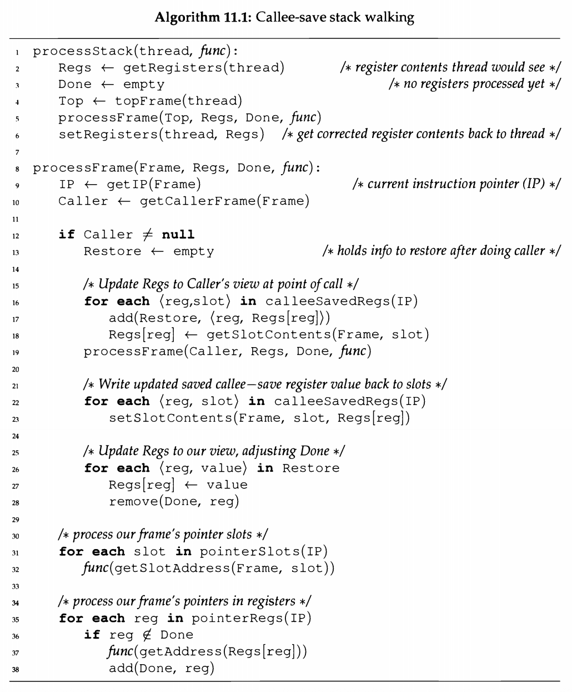
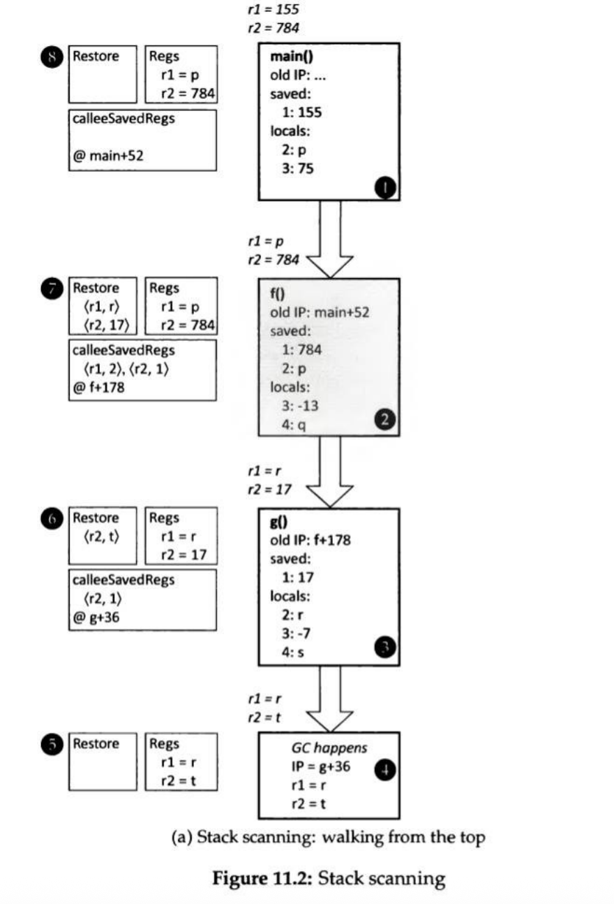
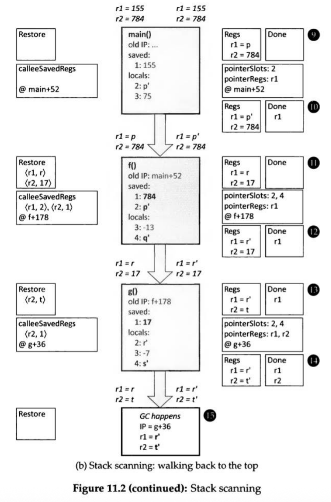
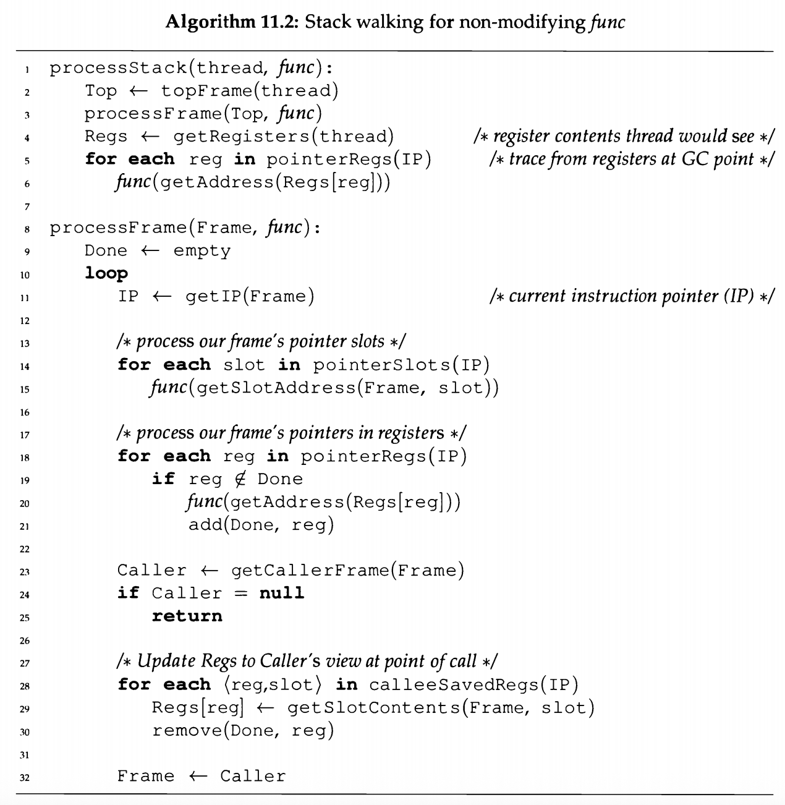

# 第11章 运行时接口

一个自动内存分配管理系统的核心是回收器和分配器，它们的算法和数据结构，但是如果它们没有提供合适的访问方法给程序，或者它们自身没有合理地接入底层平台，则几乎无毫无使用价值。此外，有些算法对编程语言的实现有特殊的要求，例如，需要提供一些信息或维护特定不变性。回收器（和分配器）和系统其余部分之间的接口都是本章关注的，包括上层的语言和编译器，以及下面的操作系统和系统库。

我们按顺序考虑以下事情，新对象分配；寻找和调整对象、全局区域和栈里的指针；访问或更新指令或对象的操作（屏障）；修改器和回收器之间的同步；管理地址空间；和使用虚拟内存。

 <!-- more -->

## 分配接口

从编程语言的视角看，一个创建新对象的请求不只是返回一个已分配的对象，也需要按语言和它的实现的全部要求进行初始化。不同的语言覆盖了广泛的需求。需求的一端是C，它只要求一个新分配的指定大小的存储单元 -- 单元里的值是任意的，初始化这个单元完全是程序员的责任。在范围的另一端则是纯函数式语言，如Haskell，其在语言级别上需要为一个新对象的所有域都提供一个新值，无法访问未初始化的对象。

### 加速分配

### 置零

## 寻找指针

为了确定可达性，回收器需要寻找指针。一些算法策略需要指针的精确知识。实际中，安全地移动位于x的对象到新的位置x'，然后为重用它原来的指针位置需要我们更新所有x的指针到x‘。但是，安全地回收一个对象需要确定程序不在使用它了，但是反之是不正确的：保留一个程序不在使用的对象是安全的，虽然这空间比较低效（虽然它也会导致程序因为缺乏内存而失败）。因此，只要估算是保守的，回收器就可以对非移动对象的引用进行保守估算--它只能过量估算对象的引用，不能少估算。没有环回收的引用计数是保守的，而另一种保守是某些方案缺乏精确指针信息导致的。所以，它们会将一个非指针值视为一个指针，只要这个值能够引用到一个分配对象。我们讨论的第一个技术是保守指针查找，然后是多个区间的精确指针查找。

### 保守指针查找

保守指针查找的基础技术是将连续的同指针大小和对齐的字节序列作为一个可能的指针值，称为模糊指针。因为回收器知道组成堆的内存区域，即时其中一些区域已经被回收了，它也可以从不是指针的值里识别出可能的指针。为了速度，回收器的测试值的指针性的算法必须是高效的。一个典型的方法分为两步。首先，它过滤出不指向内存中任意堆区域的值。如果堆是一个连续区域，则通过范围判定来完成这个识别，或者通过获取指针的高位获得块号，然后查找堆块里的表。第二步是看被引用的堆内存是否实际被分配出去了。它可以通过查询已分配字的位表来检查。例如，Boehm-Demers-Weiser保守回收器【Boehm and Weiser，1988】以区块的形式运作，每块对应特定大小的域。一个块有一个关联的元数据，它可以记录域大小，以及一个位图记录已经分配的和空闲的域。在使用堆边界做范围检查之后，这个算法的下一步是检查引用块是否全部被分配了，如果引用块被分配了，它检查特定的对象是否被分配了。只有这样它才会在标记阶段设置标记位。整个过程，如图11.1所示，有一个典型的路径长度，大概30条RISC指令。

一些语言需要指针指向它引用对象的第一个字，或者特定到对象的特定偏移，如在对象头之后特定字节（见图7.2）。这允许一个保守回收器忽略一些可能的内部指针值，因为它们违反了规范引用指针的格式。在两种场景下构建保守指针查找算法是相对简单的；Boehm-Demers-Weiser保守回收器可以配置成任意一种形式。关于C的保守回收需要注意的是数组的一个内部引用指向数组外的元素是合法的。因此，在这种场景下，C的保守回收器可能需要记录两个对象，或者给数组多分配一个字来避免混淆。一个显式释放的系统可能会在对象间插入一个头，这也可以解决这个问题。在编译器优化的情况下，指针可能会被进一步“损坏”；183页讨论到了这个问题。

因为一个非指针位模式可能会导致保留一个实际不可达的对象，Boehm【1993】设计了一个称为黑名单的机制，当虚拟地址与非指针值相关的时候， 这个机制尝试避免使用这个虚拟地址空间的区域作为堆。实际上，如果回收器遇到一个可能的指针，它指向未分配块的内存，则回收器会拉黑这个块，即不会在分配这个块。即使分配了这个块（一个对象在这个地址上），未来的追踪也会将这个错误的指针识别为真正的指针。这个回收器也支持块用于严格非指针对象，如位图。识别这个数据，不但会加速回收器（因为它不需要扫面这些对象的内容），而且它也能防止因非指针数据的位图模式而导致的过度黑名单。这个回收器未来会优化它的黑名单，即通过区分可能为内部的无效指针和不是内部的无效指针，因为它们来自具有不允许堆存储内部指针的配置的堆。在可能的内部场景下，引用块被所用使用场景拉黑，而在另一个场景下，回收器允许块被用于小的非指针对象（这不会导致太多的浪费）。为了初始化黑名单，回收器在第一次堆分配前会马上做一次回收。它也避免使用地址以许多0结尾的块，因为栈上的非指针数据经常会有这样的值。

### 使用标志值的精确指针查找

### 对象里的精确指针查找

### 全局根里的精确指针查找

### 栈和寄存器里的精确指针查找

例如，Appel【1987】所提倡的一种处理调用栈的方式是堆分配活动记录。【Appel and Shao，1994，1996】和Miller与Rozas【1994】的计数参数也是一样的。一些语言实现使得栈帧和堆对象一样，因此可以统一处理。例如Glasgow Haskell编译器【Cheadle et al，2000】和Non-Stop Haskell【Cheadle et al，2004】。给回收器提供栈内容的特定信息也是可以的，例如Henderson【2002】使用客制化C语言实现Mercury语言，然后Baker et al【2009】进行了改进以支持实时Java实现。

然而，大部分语言因为多种效率的需要给予了栈帧特殊地对待，从而获得最佳性能。我们有三个问题要考虑：

1. 在栈上找到栈帧（活动记录）。
2. 在每一帧里找到指针。
3. 处理传递约定，如参数，返回，寄存器值保存和恢复。

在大部分的系统里不只是回收器需要在栈上寻找栈帧。如异常处理和延续的机制也需要解析栈，更不用说栈检查在调试中的巨大价值，以及在某些系统里是必须的，如Smalltalk。当然给程序员的视图可能是一个非常干净的视图，而不是更优化和‘原始’布局的实际栈帧。因为栈解析通常是有用的，栈帧布局约定通常是为它提供的。例如，许多设计会在每帧里包含一个动态链域，其指向前一帧。其它的域通常位于帧引用点的固定偏移里（帧指针或者动态链的地址）。它们可能会包含返回地址，静态链等等。系统也会提供一个映射表，可以根据返回地址确定该地址所在的函数。在一个非回收的系统里，这只会出现在调试器符号表里，但是许多管理系统会访问程序里的这张表，所以它是加载或者代码生成信息的一部分，而不只是辅助调试器表。

为了寻找栈帧里的指针，一个系统需要显式地添加栈映射信息到每一帧来帮助回收器。这个元数据由位图组成，标记了哪些栈帧域包含指针，或者系统会将帧分为包含指针区和不包含指针部分，元数据会给出每个区的大小。需要注意的是每个函数都会有一些初始化指令，在这期间新栈帧存在了但是没有完全初始化。在这期间回收会有问题；参考我们后面在11.6节关于垃圾回收安全点和修改器握手的讨论。或者我们也可以通过仔细的初始代码回收器分析来获得这些信息，通过小心地使用机器上的push指令来支持他们或者其它客制化的方法。如果编译器总是将每个栈域的信息固定为指针或者固定为非指针，则显式地栈帧扫描是更简单的方法。这个方法里整个函数只需要一个映射表。

但是，简单的映射方法不总是可行的。例如，至少有两个语言特性会使得它变得复杂：

- 泛型或者多态函数。
- Java虚拟机jsr指令。

我们之前观察到多态函数的指针参数和非指针参数会使用相同的代码来表示。因为直接的栈映射无法区分这些场景，系统需要额外的信息源。幸运的是调用者知道特定调用更多的信息，但是可能会有更多的多态函数。所以调用者可能需要“将皮球踢回给”它的调用者。但是这在最糟糕场景下的主函数调用，就会触及底部。这个场景类似于从根上区分对象【Appel,1989b;Goldberg,1991;Goldberg and Gloger, 1992]】。

在Java虚拟机里，jsr指令执行本地调用，它不会创建一个新的栈，而是直接访问调用者的局部变量。它被设计用于实现Java语言的**try-finally**特性，通过在正常场景和异常场景里使用jsr来调用**finally**块，可以用一段代码来实现这个功能。这个问题是在jsr调用期间，一些局部变量的类型是未知的，从某种意义上讲，取决于哪个jsr调用了**finally**块，一个特定变量，没有用于**finally**块但是用在更后面，可能会包含一个来自于一个调用点的指针和来自另一个调用点的非指针。对于这个问题有两个解决方法。一个是将这些场景提供给调用点来消除歧义。在这个场景下，每个栈映射不只是简单的‘指针’或‘非指针’（只有一位），我们需要针对jsr调用者有额外的场景。此外，我们需要能找到jsr返回地址，这需要一些Java字节码的分析，从而追踪哪些地方存储了这个值。此外，在现代系统中更通用的做法是变换字节码或者动态编译代码，从而简单地复制**finally**块。它极大地简化了系统的这部分功能，但是在极端场景下，它会导致基于代码体积的指数级爆炸。有经验表明，为动态编译代码生成Java栈映射是系统隐藏错误的主要来源，因此此处托管系统的复杂性控制是很重要的。我们注意到许多系统将栈映射生成延迟到回收器需要它之后才做，这节省了正常场景下的空间和时间开销，但也许会增加回收器的暂停时间。

系统不选择使用帧映射的另一个原因是它会进一步限制寄存器分配器：它必须连续的将一个寄存器按指针或者非指针使用。这在寄存器数量极少的机器上是最不希望看到的。

需要注意的是，不管我们是一个函数一个映射表，还是函数不同部分有不同的表，编译器都必须通过后端传播类型信息。如果我们在写编译器之前就知道这个需求则可能不会太难，但是对于改造已经存在的编译器则会相当地困难。

**在寄存器中寻找指针**。到目前为止，我们忽略了机器寄存器中的指针问题。为何处理寄存器会比处理栈上内容更复杂，这里有几个原因。

- 如我们前面指出的，即使对于整个函数每个栈帧域都固定为指针或者非指针，也不方便将这个规则放到寄存器上 -- 或者是进一步限制特定的寄存器集合里只需要指针或者只能是指针。这只有在具有大量寄存器的机器上有实际意义。因此，大部分系统上每个函数都有多张寄存器表。
- 即使保证全局根，堆对象或者局部变量存储的指针不是内部指针（182页）或者派生指针（183页），高效的局部代码序列也可能导致寄存器里保存这类‘不整洁的’指针。
- 调用约定总是要求一些寄存器遵循调用者保存协议，即当这些寄存器里的值跨调用存活时，调用者必须保存和恢复这些寄存器；另一些寄存器遵循被调用者保存协议，即在被调用者使用这些寄存器前，被调用者必须保存这些寄存器到栈上，然后结束时在恢复回来。调用者保存的寄存器没有问题，因为调用者知道它们里面的值的类型，但是被调用者保存的寄存器的内容只有回溯调用者栈才能知道。因此，一个被调用者无法识别出一个寄存器映射里一个未保存的被调用者保存寄存器包含的值是否是一个指针。类似的，如果一个被调用者保存一个被调用者寄存器的值到一个栈域，这个被调用者也无法识别出这个域是否包含指针。

许多系统理所当然地需要一个调用者保存栈回溯机制，这是为了重构栈的帧结构和调用链，特别是对于那些没有指定‘前一栈’寄存器的系统或者其它类似系统。

现在我们引入一个方法来解决被调用者保存寄存器问题。首先，我们添加一个元数据来表明每个函数保存的被调用者寄存器，以及寄存器保存的栈帧位置。我们假设一个更常见的设计是，函数在函数开头处附近一次性保存它将使用的所有被调用者保存的寄存器。如果编译器更加的复杂，这些信息在函数里的不同地方是不同的，则编译器将需要输出每个地方的被调用者保存信息。

从顶帧开始，通过’还原‘被调用者保存的被调用者寄存器来获取函数调用点的调用者的寄存器状态。随着我们继续进行，我们记录了我们恢复的寄存器和被调用者在其中保存的值，这个可以用来进行栈回溯。当我们到达栈底的时候，因为不存在调用者了，所以我们忽略所有的被保存的被调用者保存寄存器的内容。因此，对于栈，我们可以为回收器产生任意指针，然后允许回收器去更新它们。

当我们回溯栈的时候，我们会重新保存被调用者寄存器。需要注意的是，如果回收器更新了一个指针，则它将会适当地更新被保存的值。我们从我们的边内存获取被调用者保存在寄存器里的值。一旦我们为被调用者保存的所有被调用者寄存器做这个操作，我们为被调用者产生指针，然后在需要的时候允许被调用者更新它们。但是，我们要跳过那些内容已经在调用者里处理过的寄存器，从而避免第二次处理它们。在一些回收器里，同一个根处理两次不会有害；mark-sweep就是属于这种中的一个例子，因为标记两次没有问题。但是，在复制回收器里会天然地假设任意没有分发的引用是在fromspace。如果回收器处理相同的根两次（不是指向相同对象的不同根），则它会做对象的tospace副本的额外复制，这是有害的。

我们在算法11.1里提供了这个过程的细节，现在继续描述图11.2里演示的例子。在这个算法里，*func*应用于每个栈槽和寄存器的函数，例如算法2.2（Mark-Sweep，Mark-Compact）的markFromRoots里的**for each**循环的循环体，或者算法4.2（Copying）的回收里的根扫描循环的循环体。

考虑到图11.2a，注意到第一个调用栈，即右边阴影表示的部分。导致该栈的操作序列如下。

1. 在main开头执行，此时r1包含155，r2包含784。无论什么调用了main，它都是在回收器系统之外，因此，它无法指向堆分配的对象，因此那些寄存器内容也不是引用。类似的，我们对返回地址oldIP也不关注。当它执行的时候，main把r1保存在槽1，设置local 2指向对象p，local 3保存75。然后调用f，r1保存p，r2保存784且main+52为返回地址。
2. 函数f保存返回地址，保存r2到槽1，r1到槽2，且设置local 3为-13，local4指向对象q。然后调用g，r1保存对象r的引用，r2保存17，f + 178是返回地址。
3. 函数g保存返回地址，保存r2到槽1，设置local 2指向对象r，local 3保存-7和local 4指向对象s。

每个栈帧框上面的寄存器内容表明执行进入到问题函数里的值，栈帧框下面的内容是栈帧停止执行时的值。这些是我们回溯进程时需要尝试恢复的值。

现在我们垃圾回收发生在g的中间。

4. 垃圾回收发生在g的g+36的位置上，此时寄存器r1保存一个到对象r的引用，r2爆粗一个到对象t的引用。我们可以认为IP和寄存器值被保存到一个暂停线程数据结构里，或者可能就在垃圾回收例程的实际栈上。

在某些时候，垃圾回收在这个线程栈上调用processStack，同时*func*作为复制回收器的copy函数。这是绝大多数有趣的场景，因为一个复制回收器通常会更新对象引用，因为目标对象被移除了。图11.2a左边的框表示当我们继续按照g，f，main顺序检查栈帧时Regs和Restore的值。我们在图的左边展示了一些Restore和Regs的快照，它们标有与这些评论相对应的数字。

5. 这里processStack从线程状态里恢复寄存器到Regs和初始化Restore。在算法11.1里的15行执行处理g的栈帧。

6. 此时我们已经更新了Regs，且将信息保存到Rstore里供下次使用。在19行执行处理g的栈帧。因为g已经将r2保存到槽1，f可以看到的值是17。我们将g的r2应该是t的事实保存到Restore里，在processFrame递归调用之后，我们回到g的处理上。我们在g栈的左边框里显示calleeSavedRegs的返回值对g的IP值。
7. 执行到f栈帧的19行。我们分别从槽2和1中恢复r1和r2。

8. 在19行执行main栈帧。这里我们假设Caller是null，所以我们不需要恢复任意的被调用者保存寄存器--它们不包含指针，因为它们的值来自于托管世界之外。

重建了main调用f时的寄存器内容，我们可以继续为main处理栈帧和寄存器，类似处理f和g的。转到图11.2b，我们演示了每个栈帧的两个状态：首先在算法11.1的35行的状态，然后是38行的状态。栈帧本身表明的是35行的状态。虽然它们的值没有必要改变，但是它们是用黑体字写的，不是用灰色写的。

9. Regs保存了main调用f时候的寄存器值；同时Done为空了。

10. 寄存器r1通过*func*更新的（因为main+52的时候r1在pointerRegs里）。Done表明r1（可能）指向了它引用对象的一个新位置。
11. Regs保存了f调用g的时候的寄存器值。注意到r1和r2被保存到f栈帧的槽2和1的位置上，它们在Regs里的值已经通过Restore设置了。
12. 寄存器r1被*func*更新，并被添加到Done里。
13. Regs保存了垃圾回收在g发生时候的寄存器值。特别是，r2里的值被保存到g栈帧的槽1里，然后它在Regs里的值通过Restore设置。因为r1没有被Restore设置，所以r1保留到Done里。

14. 寄存器r1被跳过了（因为它在Done里），但是r2被*func*更新且被添加到Done里。

最后，在第15步processStack将Regs里的值存储回线程状态里。

**算法11.1的变化**。算法11.1有几个合理的变化。以下是一些特别值得关注的：

- 如果*func*不更新它的参数，则可以忽略Done数据结构，更新它的语句，和36行的条件测试，37行的无条件调用*func*。这个简化应用到非移动的回收器和移动回收器的非移动阶段。如果一个移动回收器的*func*实现在相同槽上调用多次时可以正常工作，则也可以应用它。
- 比起在processFrame后期调用*func*，可以向上移动结尾的两个for循环，将它们插到9行之后。如果和变化的一个结合，产生的算法只需要按一个方向处理栈，比起递归实现它可以通过迭代实现，如算法11.2所示。
- 如果一个系统不支持被调用者保存寄存器，且一个函数希望寄存器的值可以跨调用保存，则函数必须自己保存和恢复它（调用者保存）。一个保存的调用者保存寄存器值在调用者里是知道类型的，因此可以将其当成一个局部或者临时变量。由此得到了大大简化的算法 11.3，它也是迭代的。

压缩栈映射。实验表明存储栈映射需要的空间占系统里代码大小可观的一部分。例如，Diwan等人【1992】发现它们的VAX的Modula-3的表占代码大小的16%。Tarditi【2000】描述了压缩这些表的技术，被应用到了Marmot Java编译器里，取得了4～5倍的压缩比率，最后的表大小平均是代码大小的3.6%。这个方法利用了两个经验观察。

- 虽然许多垃圾回收点（GC-点）需要映射表，但是这些表许多都是相同的。因此，如果许多GC点共享相同的映射表，则系统就可以节省空间。在Marmot系统里，对于调用点也是如此，其倾向于只有少数点跨过它们存活。Tarditi【2000】发现这个技术会减少一半空间。
- 如果一个编译器使得栈帧上里的指针成组的挨着，则会有更多的映射是相同的。使用活跃变量分析和图着色算法来放置不相交生命周期的指针变量到相同槽里，也会增加相同映射的数量。Tarditi【2000】这对于大程序是非常重要的。

Tarditi方案的完整流程如下。

1. 映射（稀疏的）返回地址集到（小的，稠密的）GC点标号集合。在这个映射里，如果表项t[i]等于返回地址ra，则ra映射到GC点i。
2. 映射GC点编号集合到一组（小的，稠密的）映射编号。这是有用的，因为多个GC点经常有相同的映射。给出上诉的GC点i，它可以写作映射编号$mn = mapnum[i]$。
3. 使用映射编号索引一个映射数组来获得映射信息。从前一步给出mn，它可以被写作$info = map[mn]$。

在Tarditi的方案里，映射信息是32位字的。如果信息适合了31位，则字是充足的，它的低位会被设置为0；否则低位被设置为1且剩下的位指向一个变长记录，其给出完整的映射。这个细节可能需要根据不同平台做处理（语言，编译器，和目标架构），因此可以参考论文获得精确的编码。

Tarditi也探索来几个将IP（指令指针）值映射到GC点编号的组织方式。

- 栈映射相同的相邻GC点使用相同的编号，Diwan等人【1992】使用了相同的操作。这个记录只有第一个GC-点，然后后续的一个地址小于表中的下一个被认为是等价的。
- 使用二级表来表示大的GC点地址数组。这为每个64KB代码空间块创建了一个分离的表。因为块中所有的GC点有相同的高位，它只需要在每个表项里记录低16位。在32位地址空间里它本质上只保存了一半的表空间。我们也需要知道块中第一个GC点的GC编号；简单的将它加到块表里的返回地址的索引中会获得匹配的IP的GC点编号。
- 使用一个稀疏的GC点数组和通过检查IP值附近代码进行插值。这是选择代码里相距k字节的点，表明它们放置的位置，它们GC编号和它们的映射编号。它从IP值之前的最高位开始向前反汇编代码。当它找到调用（或者其他垃圾回收点），它会更新GC点编号和映射编号。需要注意的是它必须是能通过检查识别出GC点。Tarditi发现即使是x86，为了这些目的的反汇编过程也不是很复杂或者很慢，虽然这个方案包括了16个元素缓存来降低相同返回地址值的重复计算。它是所有检查方案中最紧凑的，并且反汇编的开销也很小。

Stichnoth等人【1999】描述了一个不同的栈映射压缩技术，应对的是可以为每条指令产生一个映射。类似于Tarditi【2000】的稀疏数组，它使用一个方案来记录代码中特定引用点的所有信息，然后从最近前向点到目标IP值进行反汇编。虽然，在Stichnoth等人里相比GC点编号，他们计算了实际的映射。里面的引用点的起始位置是在代码里的基本块的开始位置。但是，如果在一个块结束位置的映射和下一个开始位置的映射相同--则没有流合并会影响到这个映射--然后他们将两个块当成一个大块。从每个引用点向前工作，它们在这个点（因为x86有变长指令）编码指令长度，以及指令导致的到映射的差值。例如，指令可能会压入或者退出栈上值，加载一个指针到寄存器等等。他们使用哈夫曼编码差值流，从而获得额外的压缩。跨过一组评测集，他们获得的平均映射大小大约是代码大小的22%。他们认为，作为代码大小的一小部分，这个方案不应该浪费带有大寄存器集合的机器 -- 以及指令大小的增加。同时，对于固定长度指令的机器使用的整体空间可能会更好，因为记录指令长度仍然有一个可用的固有开销，即使（类似于Tarditi【2000】）他们在大部分场景下使用一个反汇编器来记录指令长度。他们仍然需要一位的部分来标记那些他们无法合法允许垃圾回收的区域，例如在写屏障序列的中间。给定一个固定指令长度的机器可能会使用一些东西如每条指令4字节，并且x86的平均指令长度可能会是一半或者更少，使用了Stichnoth等人的技术的固定长度指令机器的表大小可能会占代码体积5-10%左右的范围。

### 代码里的精确指针查找

### 处理内部指针

### 处理派生指针

## 对象表

## 来自外部代码的引用

## 栈屏障

之前我们已经描述过栈上指针查找的技术，但假设可以一次性扫描整个线程的整个栈，即系统可以长时间暂停来处理它的整个栈。当一个线程在运行的时候进行栈扫描是不安全的，因此我们要么必须暂停线程几个周期或者让线程帮我们扫描（即，调用一个扫描例程，本质上还是暂停自己）-- 见11.6节

## GC安全点和修改器暂停

在11.2节，我们提到回收器需要知道哪些栈帧槽和哪些寄存器保存了指针的信息。我们也提到这些信息会随着函数中发生垃圾回收的位置（我们会称函数指针为IP）变化而变化。关于哪些地方可以出现垃圾回收有两个关键问题：一个给定的IP对于垃圾回收是不是安全的，栈映射表的大小（详见11.2节压缩映射表），如果越多的IP是合法的则表会越大。

什么情况下一个给定的IP对于垃圾回收是不安全的？大多数系统偶尔会有一些必须完整运行的短代码序列，以保持垃圾回收所依赖的不变量。例如，一个典型的写屏障需要做底层写和一些记录。如果一个垃圾回收发生在这两步之间，则回收器会丢失掉一些对象或者无法更新一些指针。系统通常有一些需要对垃圾回收是原子化的短序列代码（尽管对于真正的并发，它不一定是原子化的）。除了写屏障，还有一些其它的例子如创建一个新栈帧，或者初始化一个新对象。

如果一个系统允许在任意IP上进行垃圾回收，则某种程度上它就更简单 -- 因为它不需要关心线程是否在垃圾回收安全点挂起的问题，垃圾回收安全点简称GC安全点或者GC点。但是，另一方面这样的系统也更复杂，因为它必须在每个IP上支持stack map，或者使用不需要它的技术，如不需要协作的C/C++编译器。如果一个系统允许在大部分IP上进行垃圾回收，则当它需要回收且一个线程被挂起在一个不安全点时，要么它可以向前解释执行挂起的线程直到它到达一个安全点，要么它可以短暂地唤醒线程（概率地）一段时间直到线程执行到安全点。解释执行会遇到低概率的竞争问题，而线程唤醒成功是概率性的不能保证一定唤醒。这样的系统可能也会有巨大的映射开销【Stichnoth et al, 1999】。

许多系统做了相反的选择，只允许垃圾回收在某些严格的安全点进行，然后只需要为这些点生成stack map。保证正确性所需的安全点最小集包含每个分配（因为垃圾回收经常在这里发生）和每个会导致分配或者导致线程挂起等待的函数调用点（因为如果线程挂起，其它的线程可能会导致垃圾回收）。

除了保证正确性所需的最小安全点集，一个系统可能希望允许在更多地地方进行垃圾回收，从而保证垃圾能够快速进行，而无需长时间等待线程到达一个安全点。为了更好地保证这个，每个循环都需要有个安全点；一个简单的规则是在函数的回边放置安全点。此外，需要在每个函数的入口点或者返回点放置安全点，因为有些函数特别是递归的函数，在遇到安全点之前或执行许多的调用和返回。由于这些额外的安全点实际不会执行任何可能触发垃圾回收的操作，它们只是添加了一个是否需要/请求垃圾回收的检查，因此我们称它们为GC-检查点。这种检查给修改器的正常操作增加了额外开销，不过也许影响不大，特别是如果编译器做了些简单的操作来降低这个开销。例如，它可以在一些简单的或者没有循环或函数调用的函数里忽略这种检查。同时也会插入一个额外地循环级别，它可以避免在每个循环迭代里都做检查，而是每n个迭代检查一次。如果检查本身是廉价的，则这些操作可能是没必要的。在任意场景下，频繁操作的开销和不频繁操作的延迟都需要一个明确地抉择。

Agesen【1998】评估了两种导致线程在GC点挂起的方式。一种是轮询，如上所述，线程回会检查一个标志，这个标志表明需要一个回收。另一个是补丁，它涉及修改线程下一个GC点的代码，从而当线程重新开始的时候，它会在下一个GC点暂停。它类似在调试器里放置一个临时断点。Agesen发现补丁的开销远低于轮询，但是同时它也更难以实现，在并发系统里有更多的问题。

在提出GC-检查点的想法时，我们已经引入了回收器和修改器线程之前的握手机制的概念。即时一个系统没有包含真正的并发而只是在一个处理器上复用多个修改器线程，这样的握手可能也是需要的--回收器需要它来说明垃圾回收器的需求，然后唤醒所有没有到达安全点的挂起的线程，从而它可以执行到一个安全点。一些系统只允许线程在安全地挂起，从而避免额外的复杂度，但是因为其它原因导致系统可能无法控制线程的所有方面，因此非常需要这个握手协议。

为了正确性，我们提到了一些握手的部分机制。每个线程维护一个线程变量，其表明在安全点系统的剩余部分是否需要该线程的响应。这个机制不只是可以用作垃圾回收的信号，也可以用在其它事情上。在一个GC检查点上，线程会检查线程局部变量，如果它是非0值，则调用一个系统例程其提取这个变量的数据，根据这个值采取相应的动作。其中一个特定值表示处于垃圾回收的时间点了。当线程注意到这个请求，它会设置另一个线程变量来表示它已经关注了，或者减少一个回收器线程等待的全局变量。系统通常会将线程变量设计成低开销访问，所以这会是一个好方法。

另一个可能性是设置挂起线程保存的线程状态里的处理器标志代码。然后一个GC检查点可以由一组比调用系统例程廉价得多的条件分支组成来响应请求。这个方法只要处理器有多个条件代码集（例如PowerPC）就能工作，且可以保证唤醒的时候不会在外部代码里。如果机器有足够多的寄存器，则其中一个可以专门作为信号寄存器，寄存器的使用几乎和条件码开销差不多。如果线程在外部代码里，当线程从外部代码出来的时候，系统需要一个额外方法来获得关注（除非它已经作为一个安全点挂起了）。劫持返回地址是一种在外部代码完成时获得响应的方法（见11.5节）。

在某些情况下，一个操作系统级的线程间信号量可以作为标志设置和返回地址劫持之外的另一种方案，如同那些由一些POSIX线程的实现提供的，可能是种可行的方案。它在通用可移植性上存在问题，且可能不够高效。部分情况下可能会很慢，因为一些长路径通过操作系统内存创建和分发信号到用户级别的处理句柄上。这会很慢，因为它不但需要一个低级别的处理器中断，同时也需要缓存和TLB的作用。

总的来说，有两个基本的方法：同步通知，也可能称为轮询，和通过一些信号量或者中断的异步通知。每个方法都有它的固有开销，在不同平台上也是不同的。根据不同的架构，轮询可能还需要一定程度的编译器配合。进一步的，异步通知通常需要转为同步，因为扫描栈或者其它需要的操作不是每个时刻都是可以做的。因此，信号处理主要的目标变成设置一个局部标志到线程里，然后线程保证会尽可能快地响应并且完成相应的动作。

我们进一步观察到在线程之间实现同步从而直接扫描栈的过程中，需要考虑硬件和软件的并发问题，针对这些问题，我们在第13章会给出一些背景资料。特别相关的可能是13.7节，它讨论了如何协调线程以从回收的一个阶段到另一个阶段，以及在回收的开始和结束的地方修改器线程需要做的事情。

## 垃圾回收代码

## 读和写屏障

有几类垃圾回收算法需要在修改器执行期间检测特定的指针。如果一个回收器只回收部分堆，则任意从区间外引用到区间内的对象的引用都是回收器感兴趣的：在缺乏进一步信息的情况下，回收器必须将这些引用视为根。例如，分代回收器必须识别出所有指向年轻代对象且被写入到老年代对象的引用。如同我们将在15章看到的，修改和回收交错（无论回收器是否运行在自己的线程里）导致修改器有很大概率会对回收器隐藏指针。如果这些指针没有被识别出来以及传递给回收器，则存活对象可能会被过早地回收掉。所有的这些场景都需要修改器实时地给回收器工作队列添加引用。这个工作是通过读写屏障完成的。

其它章节里的特定算法解决的是这些算法所需的读写屏障的特定内容。而此处我们给一些通用的意见，这些意见是关于如何实现屏障的。为了从回收算法的特定需求，如分代或者并发回收，抽象出来，我们关注的是识别和记录‘感兴趣的’指针。识别主要是判定一个特定指针是‘感兴趣的’，而记录则是为了后面给回收器使用。某种程度上识别和记录是正交的，虽然有些识别方法会让自己更适合于特定的记录方法。例如，通过页保护违反识别让它自己更适合记录正在修改的位置。

### 工程

一个典型的屏障涉及一个或者多个守卫行为的检查。典型的检查包括一个正在存储的指针是否为空，和正在解引用的对象和它指向的对象的代际关系，以及一个典型的行为是在一个记录集里记录一个对象。所有检查和动作的代码可能会太大而无法被完全内联，这取决于实现。即使是一个相对简短的指令序列也会产生非常大的编译代码，和指令缓存性能不佳的风险，因为大部分代码都相对执行的较少。因此，设计者经常拆分代码，通常拆分为“快速路径”和“慢路径”两部分。快速路径为了速度会被内联，只有在需要的时候会调用慢路径部分；只有一份慢路径的复制，这是为了节约空间和提升指令缓存的性能。这里的关键点在于快速路径需要包含绝大部分通用场景，且慢路径尽可能地少出现。然而，有些时候将相同的原则应用到慢路径代码上是有帮助的。如果屏障涉及多个测试--它们经常是这样的--则排序这些测试是重要的，这是因为第一可以一次过滤出最重要的场景，第二下一个更大场景集合等等，执行测试的成本模数。在这个调优过程中，尝试各种安排以及在一定范围的程序进行性能测试是避免不了的，因为现代硬件中涉及如此多的因素，以至于简单的分析模型无法提供足够好的指导。

屏障性能另一个显著的因素是任意所需的数据结构的访问加速，如卡表。专门有个寄存器来保存数据结构指针可能是一个好的权衡，如卡表的基址，但这可能会因机器和算法的不同而有很大差异。

软件工程和维护垃圾收集算法的这些方面也是被受关注的--包括屏障，GC-检查和分配序列--他们都被构建到一个系统的编译器里了。如果可能，让编译器内联一个例程可能是最好的选择，其中序列的快速路径部分由设计者编码。这种方式下，编译器不需要知道细节，设计者可以自由地改变它们。但是，正如我们之前提到的，这些代码序列可能会有限制，如它们中间不能有垃圾回收，这是需要编译器注意。编译器可能会不得不去在这些代码上关闭一些优化，如留下一些明显的死存储指令其保存一些对回收器有用的值，和重排序屏障代码，以及将其与周边代码混合在一起。为此，编译器可能支持特定的pragma或者标记，从而设计者可以用来识别特定的属性，如不可中断的代码序列。

在本节的剩余部分我们讨论写屏障。我们将读屏障的讨论延迟到后面我们讨论增量和并发回收的章节里，因为这是它被使用到的上下文。写屏障比读屏障更复杂，因为它们不但需要识别“感兴趣的”写，而且必须记录后续垃圾回收需要使用到的信息。相反的，读屏障通常会导致一个立即的行为，如把刚刚加载的引用目标复制到tospace。

### 写屏障精度

感兴趣的指针可以通过不同的策略和机制来记录。策略控制着在记录集里记录的感兴趣指针的位置的精度。策略的选择是在给修改器或者给回收器添加固有开销之间的平衡。通常更偏向于在相对不频繁的回收器的动作里（如发现根节点）而不是在非常频繁的修改器的动作里（如堆存储）添加固有开销。没有屏障，指针存储通常非常快（虽然空指针或者数组边界检查通常也是托管语言所需要的）。添加一个写屏障会增加指针写的指令数两倍或者更多，当然如果屏障的缓存局部性好于修改器自身，则这些开销部分会被消除（例如，当写屏障记录一个感兴趣的指针时，暂停用户代码可能是不必要的）。通常在记录集里越精确地记录感兴趣的指针，意味着回收器寻找指针需要做的工作更少，而修改器则需要花费更多工作来过滤和记录它。一个极端情况下，在分代回收器里，不记录任意指针存储会将所有修改器的固有开销转移给回收器，其必须扫描堆中所有的其它空间来寻找到所需代的引用。尽管这不像是一个常规成功的策略，但线性扫描比追踪有更好的局部性，且如果没有从编译器或者操作系统上支持识别指针存储，则这可能是唯一的方式进行通用的收集【Bartlett，1989a】。Swanson【1986】和Shaw【1988】已经提出这比起简单的半区复制能降低三分之二的垃圾回收开销。

记录集策略有三个维度。首先，怎样精确的指针写需要被记录？不是所有的指针都是回收器感兴趣的，但是无条件的记录比起过滤出不感兴趣的指针，可能会给回收器强加少量的固有开销。记录集的实现是这个开销的关键。通过一个廉价的机制来添加一个子项的记录集，如简单地在一个固定大小的表里写一个字节，会更偏向于无条件记录，特别是如果加分是幂等的。另一方面，如果添加一个子项更昂贵或者记录集的大小是关键因素，则过滤掉不感兴趣的指针是更值得做的。过滤对于并发或者增量回收器是基本的，它用于保证它们的工作队列最终会为空。对于一个特定的过滤方式，多少过滤可以做内联和什么时候调用一个非内联例程完成过滤以及有时候会添加一个指针到记录集之间是需要平衡的。越多的过滤是内联完成的，需要执行的指令就越少，但是代码体积将会增加且更大的指令缓存踪迹可能会抵消性能收益。这需要小心地调试过滤测试的顺序和决定它们中哪些内联。

第二，指针的位置以什么粒度记录？最准确的方式是记录域的地址到指针被写的地方。但是如果一个对象有许多的域则这会使得记录集的大小增加，如一个数组被更新。一个可选的方式是记录包含这个域的对象地址：这也允许需要过滤的冗余，而域记录则不会有（因为域里通常没有空间记录已经被记录的）。对象记录需要回收器在扫描期间扫描对象里的每个指针，从而发现那些被称为对象需要被记录。假设如果一个数组的一个槽被更新，则很多槽可能也会被更新，则一个混合的方案可能是对象记录数组和域记录标量。相反的是，域记录数组（避免扫描整个对象）和对象记录标量（因为它们倾向于更小）可能是明智的。对于数组，只记录数组的一部分可能是有意义的。这类似类似于卡标记，但是只特定于数组和数组的索引对齐，而不是与虚拟内存中的数组域的地址。是否存储对象或它槽中的一个可能也依赖于修改器持有的信息。如果写动作知道对象地址和域，屏障可以选择记录任意一个；如果只有域地址被传递给屏障，则计算对象的地址会导致更高的固有开销。Hosking等人【1992】解决了这个困境，在一个解释性的Smalltalk系统中，将对象和槽的地址存储在它们的顺序存储区间里

### 哈希表

### 顺序存储缓存区

### 溢出操作

### 卡表

### 交叉映射

### 总结卡

### 硬件和虚拟内存技术

### 写屏障机制：总结

### 块表

## 管理地址空间

## 虚拟内存页保护的应用

### 重复映射

### 不可访问页的应用

## 选择堆大小

## 思考问题

