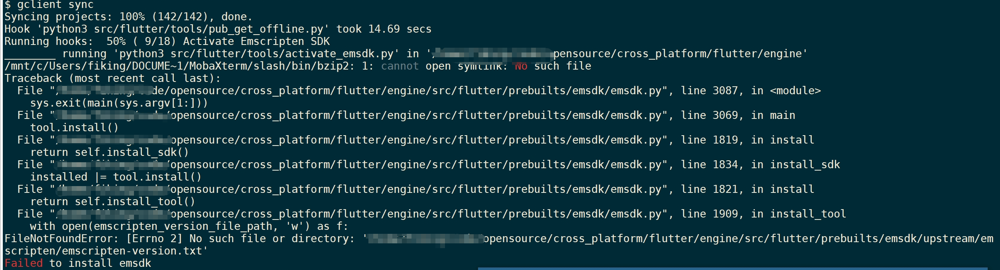
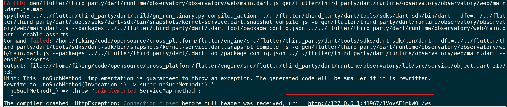
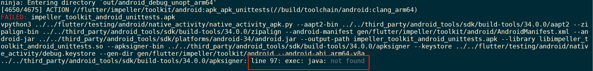

本文主要是记录在WSL2 Ubuntu22.04上搭建Flutter Engine编译环境的整个过程。

 <!-- more -->

## 环境准备

本节主要是编译前的准备工作，主要是网络配置和所需工具安装。

### 机器信息

本次编译环境的机器信息如下：

- X64处理器
- Windows 10
- WSL2 
- Ubuntu22.04

### 网络配置

由于flutter源码下载和编译过程都需要使用网络，因此需要进行代理配置。本次编译环境需要在三个地方进行代理配置。

1. 配置windows代理

   本文通过clash实现Windows上的外部网络连接，所以需要下载“clash for windows”软件，并配置代理信息。具体下载配置方式网络上有很多，可以自行查阅资料，此处不在赘述。

2. WSL2代理配置

   在clash配置完成后，可以通过浏览器访问外部网络，但是WSL2还需要在进行单独配置才能访问外部网络。通过下面的配置将WSL2网络模式设置成mirrored模式，使得它可以访问clash的代理。

   - 在.wslconfig文件中添加如下配置信息。.wslconfig文件在User目录下。

   ```shell
   [experimental]
   autoMemoryReclaim=gradual
   networkingMode=mirrored
   dnsTunneling=true
   firewall=true
   autoProxy=true
   sparseVhd=true
   ```

3. Ubuntu代理配置

   通过设置https_proxy等环境变量实现Ubuntu的代理配置。具体配置如下：

   ```shell
   #!/bin/bash
   hostip=$(cat /etc/resolv.conf |grep -oP '(?<=nameserver\ ).*')
   export https_proxy="http://${hostip}:7890"
   export http_proxy="http://${hostip}:7890"
   export all_proxy="socks5://${hostip}:7890"
   
   export no_proxy=localhost,127.0.0.1,::1
   ```

### 工具安装

本次编译需要依赖openjdk，deptools和python3等工具，需要提前安装，以避免编译过程报错。因为Ubuntu22.04已经自带了一些工具（如，python3、git等），所以本节只记录缺失的工具安装过程，其余工具信息可以参考flutter官网信息。

- 安装pkg-config、curl、unzip、openjdk

  ```shell
  sudo apt install pkg-config curl unzip openjdk-17-jdk
  ```

- 安装deptools 工具集

  首先，从google的网站上下载deptools工具集。

  ```shell
  git clone https://chromium.googlesource.com/chromium/tools/depot_tools.git
  ```

  然后，将deptools工具集添加到环境变量中。

  ```shell
  export PATH=/path/to/depot_tools:$PATH
  ```

## 代码下载

本文通过deptools中的fetch和gclient进行代码下载和同步。具体命令如下：

```shell
# 创建源码目录并进入到该目录
mkdir engine; cd engine;

# 获取代码
fetch flutter

# 同步代码和相关的依赖
gclient sync
```

## 适配Flutter SDK版本

为了保证编译出来的flutter engine能适配Flutter SDK版本，在编译前我们可以根据SDK version文件里的commit id设置flutter engine的代码版本。

```shell
# 查看本地 Flutter SDK 引擎版本, 这个文件中是包含对应的 commit id 
vim src/flutter/bin/internal/engine.version

# 调整代码
cd engine/src/flutter
git reset --hard <commit id>
gclient sync -D --with_branch_heads --with_tags
```

## engine编译

engine编译分为两个步骤，编译配置和编译。

### 编译配置

因为flutter engine有多种编译配置，因此需要进行配置以指定所需的编译配置。本文只编译arm64 Android版engine，同时设置为debug版本，具体命令和参数配置如下：

```shell
./flutter/tools/gn --unoptimized --runtime-mode=debug
```

执行此命令之后，就会生成一个编译目录 android_debug_unopt_arm64。

### 编译

上述配置执行之后，通过如下执行命令就可以完成编译。

```
ninja -C out/android_debug_unopt_arm64
```

## 报错处理

- Emscripten SDK 安装失败

  

  需要安装 pkg-config、curl 和 unzip。

- 本地IP不走代理设置

  

  需要设置no_proxy环境变量。

- 缺少JAVA环境

  

  需要安装java运行环境。

## 总结

只要网路环境没有问题，参考官方Wiki即可完成编译。

## 参考

1. [Setting-up-the-Engine-development-environment](https://github.com/flutter/flutter/wiki/Setting-up-the-Engine-development-environment)
2. [Compiling-the-engine](https://github.com/flutter/flutter/wiki/Compiling-the-engine)
3. [Flutter 引擎编译、运行与调试](https://www.sunmoonblog.com/2020/06/10/compile-flutter-engine/)


