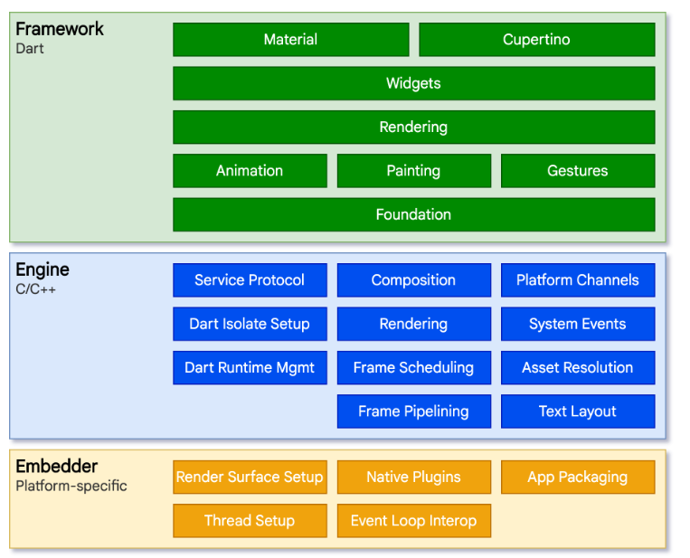
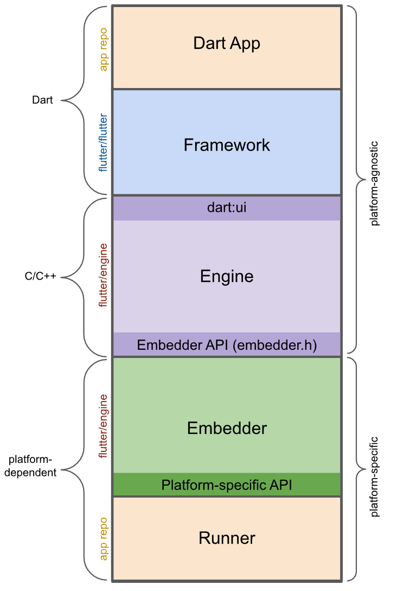

## 简介

flutter 是 Google 开源的跨平台应用开发框架。

 <!-- more -->


## 软件框架

在软件工程和编程中，框架是可重复使用的软件组件的集合，能提高新应用程序的开发效率。框架还可以定义和强制执行某些软件架构规则或业务流程，以便能够以标准化方式开发新的应用程序。

框架是架构的实例。

使用软件框架的优势：

- 提高代码质量
- 缩短开发时间
- 更出色的软件安全性
- 高效的代码审查
- 开发灵活性

框架组件：

- API 是可让不同的软件以相互理解的格式进行通信的协议
- 代码库是可重用的软件函数集合，开发人员可以将这些函数插入其代码中
- 编译器是开发人员用来将源代码转换为可部署应用程序文件的软件工具
- 调试器是帮助程序员发现和更正代码中错误的工具

控制反转

## 应用框架

**应用框架**（Application Framework）是一种[软件框架](https://zh.wikipedia.org/wiki/软件框架)，用于帮助[开发者](https://zh.wikipedia.org/wiki/開發者)构建和实现特定类型的应用程序。通常，它提供了一组工具、库和最佳实践，用于帮助开发者编写更稳定、可维护和可扩展的代码。

### 特点

- 预定义的类和函数：大多数应用框架包括用于处理常见任务（例如[图形渲染](https://zh.wikipedia.org/wiki/图形渲染)、数据库访问等）的预定义类和函数。
- [模块化](https://zh.wikipedia.org/wiki/模块化)和可重用：框架通常强调模块化和代码可重用性，以便开发者能够轻松集成或切换不同的组件。
- 最佳实践[[1\]](https://zh.wikipedia.org/wiki/应用框架#cite_note-1)：它们通常实施了特定领域或类型的应用开发的最佳实践，并在架构设计中考虑了性能、安全性和其他关键问题。

### 分类

- [Web应用框架](https://zh.wikipedia.org/wiki/Web应用框架)：如[Django](https://zh.wikipedia.org/wiki/Django)（[Python](https://zh.wikipedia.org/wiki/Python)）[[2\]](https://zh.wikipedia.org/wiki/应用框架#cite_note-2)、[Spring](https://zh.wikipedia.org/wiki/Spring_Framework)（[Java](https://zh.wikipedia.org/wiki/Java)）[[3\]](https://zh.wikipedia.org/wiki/应用框架#cite_note-3)和[Ruby on Rails](https://zh.wikipedia.org/wiki/Ruby_on_Rails)（[Ruby](https://zh.wikipedia.org/wiki/Ruby)）等，专注于Web应用程序的开发。
- [移动应用框架](https://zh.wikipedia.org/w/index.php?title=移动应用框架&action=edit&redlink=1)：如[React Native](https://zh.wikipedia.org/wiki/React_Native)（[JavaScript](https://zh.wikipedia.org/wiki/JavaScript)）、[Flutter](https://zh.wikipedia.org/wiki/Flutter)（[Dart](https://zh.wikipedia.org/wiki/Dart)）[[4\]](https://zh.wikipedia.org/wiki/应用框架#cite_note-4)等，用于构建跨平台移动应用。
- [桌面应用框架](https://zh.wikipedia.org/w/index.php?title=桌面应用框架&action=edit&redlink=1)：如[Electron](https://zh.wikipedia.org/wiki/Electron)（JavaScript）、[Qt](https://zh.wikipedia.org/wiki/Qt)（[C++](https://zh.wikipedia.org/wiki/C%2B%2B)）等，帮助在桌面平台上开发应用。


## 跨平台应用框架

## Flutter

Flutter 是一个跨平台的 UI 工具包。

在开发阶段，Flutter apps运行在一个虚拟机中，可以实时进行热更新。在发布阶段，Flutter apps被直接编译成机器码。

### Flutter架构



- 

### Flutter app 架构



### Flutter 代码分析

Flutter is a new mobile app SDK to help developers and designers build modern mobile apps for iOS and Android.

```
Flutter is a new mobile app SDK to help developers and designers build modern mobile apps for iOS and Android.
```

#### 0.0.10 版本

代码仓根目录下有四个子目录，以及一些项目说明文件，如版本、作者、许可和开发介绍等。

| bin      | flutter 的启动脚本（Linux和windows各一个）；有个internal 子目录记录所需Dart SDK和flutter Engine的版本号；初始化阶段Dart SDK也会缓存到这个目录里 |
| -------- | ------------------------------------------------------------ |
| dev      | 测试工具和测试集                                             |
| examples | flutter应用的示例程序                                        |
| packages | flutter的实际功能代码                                        |

其中packages有四个子目录，都是由Dart语言编写的，分别是

| flutter        | flutter framework代码                               |
| -------------- | --------------------------------------------------- |
| flutter_driver | flutter app运行时调测工具，如timeline、health等功能 |
| flutter_tools  | flutter app构建工具，如create、build、version等功能 |
| flutter_test   | widgets等组件测试代码                               |


### Flutter Engine 代码分析

#### 早期代码

##### 第一笔 commit

提交了Minikin，一个文字布局和绘制的库。

##### 第二次改变

代码仓变成了Sky，Minikin被删除了。

Sky 是为 Mojo 构建 UI 框架的一个实验。 我们正在探索的方法是基于标记语言的语义元素创建一个分层框架，主要分为三层。

- 方案层（theme layer），为每个小部件提供具体的视觉和交互设计。
- 组件层（widget layer），定义了组件（如input fields, buttons, and menus）之间的交互行为。
- 渲染层（engine layer），解析标记，执行脚本和应用样式信息。

###### 语义元素

Sky的标记语言定义了少量的原始语义元素，同时也允许框架和应用使用它们构建客制化的语义元素（如定义``input``, ``button``, ``menu``, ``toolbar``, ``video``, and``dialog``）。

原始语义元素有（Element）：

 - ``script``: Executes script
 - ``style``: Defines style rules
 - ``import``: Loads a module
 - ``iframe``: Embeds another Mojo application
 - ``template``: Captures descendants for use as a template
 - ``content``: Visually projects descendents of the shadow host
 - ``shadow``: Visually projects older shadow roots of the shadow host
 - ``image``: Displays an image
 - ``a``: Links to another Mojo application
 - ``title``: Briefly describes the current application state to the user


#### 重要提交

```
20cc569f5961d4e896cb2f4651fd2049066bd47c
60cc2ccf68058f3d3ff1c0a863ef796ad388eed5

```


#### Dart代码路径

```
engine/src/flutter/runtime
engine/src/flutter/third_party/dart
```

##### Shell


```shell
class Shell final : public PlatformView::Delegate,
                    public Animator::Delegate,
                    public Engine::Delegate,
                    public Rasterizer::Delegate,
                    public ServiceProtocol::Handler,
                    public ResourceCacheLimitItem {
}                    
```


## 参考

1. [Flutter实战·第二版](https://book.flutterchina.club/#第二版变化)

2. [说说 Flutter：Skia、Dart 及其历](https://wiki.kimleo.net/articles/A%20taste%20of%20Flutter/)

   Flutter 是一个跨平台 UI 框架。与之前基于 WebView/Native 的框架不同，Flutter 的 UI 呈现与平台完全无关，所有的图形渲染工作都是通过 Skia 这个引擎来实现。这样做的一个非常重要的优点就是一致性的 UI 体验。

   在 2011 年，Google 公布了 Dart。

   并且，本身 Dart 生态不够丰富的情况下，直接做一个 source to source 的替换和翻译，即Dart-to-JavaScript。

3. [跨平台方案的历史发展逻辑](https://www.cnblogs.com/baiqiantao/p/16804595.html)

   在移动互联网的浪潮下，我们开发的应用要想取胜，开发效率和使用体验可以说是同等重要。

   从本质上讲，跨平台开发是为了增加业务代码的复用率，减少因为要适配多个平台带来的工作量，从而**降低开发成本**。

   跨平台开发方案的三个时代

   - **Web 容器时代**：基于 Web 相关技术通过浏览器组件来实现界面及功能
   - **泛 Web 容器时代**：采用类 Web 标准进行开发，但在`运行时把绘制和渲染交由原生系统接管`的技术，代表框架有
   - **自绘引擎时代**：自带渲染引擎，客户端仅提供一块画布即可获得从业务逻辑到功能呈现的多端高度一致的渲染体验

   **Web 容器时代**

   定义 HTML5 与原生代码交互协议，将部分原生系统能力暴露给 HTML5，从而扩展 HTML5 的边界。这类交互协议，就是我们通常说的 **JS Bridge**（桥）。

   **泛 Web 容器时代**

   泛 Web 容器时代的解决方案优化了 Web 容器时代的加载、解析和渲染这三大过程，把影响它们独立运行的 Web 标准进行了裁剪，以相对简单的方式支持了构建移动端页面必要的 Web 标准（如 Flexbox 等），也保证了便捷的前端开发体验；同时，这个时代的解决方案基本上完全放弃了浏览器控件渲染，而是**采用原生自带的 UI 组件实现代替了核心的渲染引擎**，仅保持必要的基本控件渲染能力，从而使得渲染过程更加简化，也保证了良好的渲染性能。

   泛 Web 容器时代**使用原生控件承载界面渲染**，固然解决了不少性能问题，但同时也带来了新的问题。其始终需要 Follow Native 的思维方式，就使得泛 Web 容器框架的跨平台特性被大打折扣。

   **自绘引擎时代**

   这一时期的代表 Flutter 则开辟了一种全新的思路，即从头到尾重写一套跨平台的 UI 框架，包括渲染逻辑，甚至是开发语言。

   渲染引擎依靠跨平台的 **Skia** 图形库来实现，Skia 引擎会将使用 Dart 构建的抽象的视图结构数据加工成 **GPU** 数据，交由 **OpenGL** 最终提供给 GPU 渲染，至此完成渲染闭环，因此可以在最大程度上保证一款应用在不同平台、不同设备上的体验一致性。

4. [Flutter Framework 源码解析（ 1 ）—— 开篇和绘图引擎的用法](https://xieguanglei.github.io/blog/post/flutter-code-chapter-01.html)

5. [应用框架 - 维基百科，自由的百科全书 (wikipedia.org)](https://zh.wikipedia.org/wiki/应用框架)

6. [Flutter architectural overview](https://docs.flutter.dev/resources/architectural-overview)

7. [Chromium Mojo & IPC | 柯幽 (keyou.github.io)](https://keyou.github.io/blog/2020/01/03/Chromium-Mojo&IPC/)

   Sky uses Mojo IPC to make it possible to write UI code in Dart and yet depend on networking code, etc. written in another language.  Services are replicable, meaning that Dart code written to use the `network_service` remains portable to any platform (iOS, Android, etc.) by simply providing a 'natively' written `network_service`

8. [Flutter Platform Channel 和 FFI 通道性能测试](https://www.xdea.xyz/2020/11/flutter-platform-channel-%e6%80%a7%e8%83%bd%e6%b5%8b%e8%af%95/)

   Flutter 跨语言交互的开销测试的示例代码和测试结果。

   也许可以使用多语言共用GC的方式进行内存管理，即把GC从VM中剥离出来放到APP生命周期管理的线程中。

9. https://github.com/flutter/samples/tree/main/experimental/pedometer

   https://github.com/HosseinYousefi/jnigen_example

   https://blog.logrocket.com/dart-ffi-native-libraries-flutter/

   Dart调用Kotlin的示例程序。

10. https://github.com/dart-lang/native

    Dart的FFI工具包。

11. 


